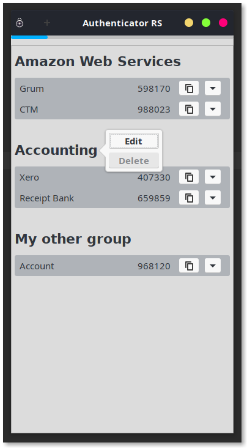
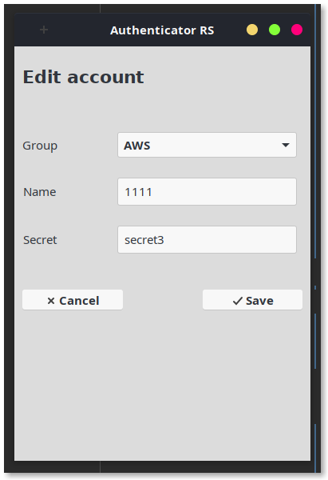
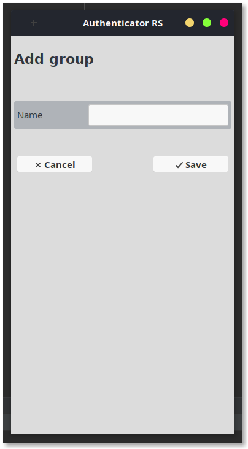

AUTHENTICATOR-RS
==================

Authenticator-rs is a TOTP-MFA application written in Rust and GTK3.

This application is very much a work in progress.

It is initially inspired by [authenticator](https://gitlab.gnome.org/World/Authenticator), which sadly sort of 
[broke](https://aur.archlinux.org/packages/authenticator/) for me 
in the latest versions of python shipped with [Arch Linux](https://www.archlinux.org/).

It is by no means as feature-rich as its python relative, more like a diamond in the rough. Well, maybe not a diamond, 
but definitely in the rough...

<kbd></kbd>
<kbd></kbd>
<kbd></kbd>

## License

Authenticator-rs is published under the [GNU GENERAL PUBLIC LICENSE v3](./README.md).

## Changelog

### 0.0.6

* Plain GTK3 version
* Not production-ready. Missing lots of UI input validation.

### 0.0.5

* Last Iced version

### 0.0.4

* Editing existing accounts

### 0.0.3

* SQLite backend! _(deleting/updating accounts coming soon! )_

### 0.0.2

* Adding new accounts
* More error handling

### 0.0.1

_Only tested on Linux (Arch Linux to be specific)._

* Initial release;
* Generating TOTP tokens for multiple accounts, every 30 seconds;
* Copy and pasting tokens to clipboard.

## Running

Download from the [release](https://github.com/grumlimited/authenticator-rs/releases) page.

    chmod +x ./authenticator-rs-0.0.6-x86_64

    ./authenticator-rs-0.0.6-x86_64

## Building

    cargo build
    
    cargo install --path=.
    
    $HOME/.cargo/bin/authenticator-rust
    
## Assets

Icon files are fromm [authenticator](https://gitlab.gnome.org/World/Authenticator).