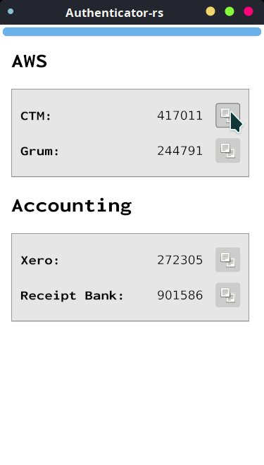

AUTHENTICATOR-RS
==================
Authenticator-rs is a TOTP-MFA application written in Rust and Iced.

This application is very much a work in progress.

It is initially inspired from [authenticator](https://gitlab.gnome.org/World/Authenticator), which sadly sort of 
[broke](https://aur.archlinux.org/packages/authenticator/) for me 
in the latest versions of python shipped with [Arch Linux](https://www.archlinux.org/).

It is by no means as feature-rich as its python relative, more like a diamond in the rough. Well, maybe not a diamond, 
but definitely in the rough...

Lastly, it is using this fantastic library: [iced](https://github.com/hecrj/iced) as the building blocks for its UI.
Thanks [@ecrj](https://github.com/hecrj) and the iced team.

<kbd></kbd>

## License

Authenticator-rs is published under the [GNU GENERAL PUBLIC LICENSE v3](./README.md).

## Changelog

### 0.0.1

_Only tested on Linux (Arch Linux to be specific)._

* Initial release;
* Generating TOTP tokens for multiple accounts, every 30 seconds;
* Copy and pasting tokens to clipboard.

## Running

Download from the [release](https://github.com/grumlimited/authenticator-rs/releases) page.

* [0.0.1](https://github.com/grumlimited/authenticator-rs/releases/download/0.0.1/authenticator-rs-0.0.1-x86_64) 

## Configuring

Create the file `$HOME/.local/share/authenticator-rs/authenticator.json`, with the following content:

    {
      "groups": [
        {
          "name": "AWS",
          "entries": [
            {
              "label": "CTM",
              "secret": "verysecret"
            },
            {
              "label": "Grum",
              "secret": "same level of secrecy"
            }
          ]
        },
        {
          "name": "Accounting",
          "entries": [
            {
              "label": "Xero",
              "secret": "this one is more obvious"
            },
            {
              "label": "Receipt Bank",
              "secret": "and this last one is obviously fake"
            }
          ]
        }
      ]
    }

The labels and group names are free copy. The secrets are your service-issued shared secrets. 

_Note: the secret values are in plain text, not base32 or anything._

Suffice to say you have to keep that file safe.

## Building

    cargo build
    
    cargo install --path=.
    
    $HOME/.cargo/bin/authenticator-rust
    