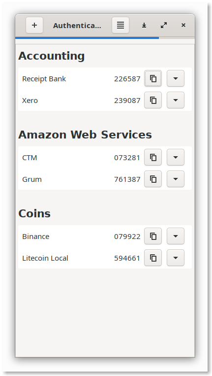
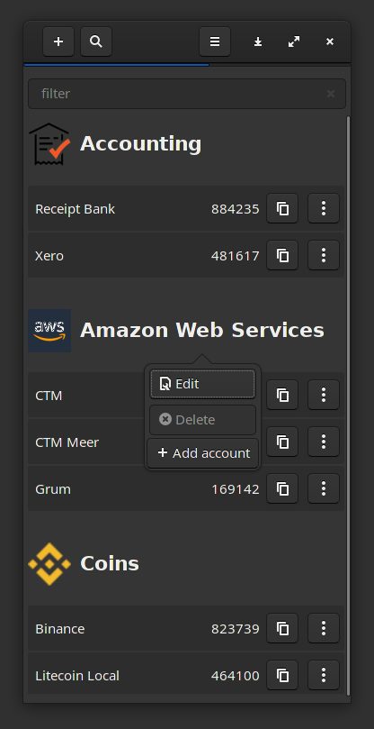
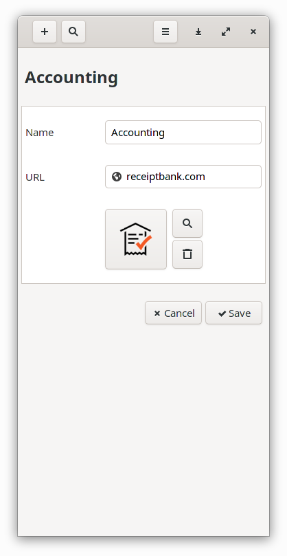
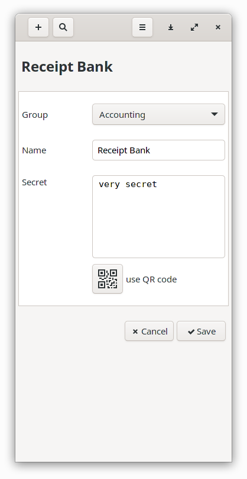
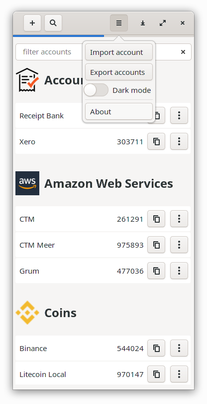

AUTHENTICATOR-RS
==================

Authenticator-rs is a TOTP-MFA application written in Rust and GTK3.

This application is very much a work in progress.

It is initially inspired by [authenticator](https://gitlab.gnome.org/World/Authenticator), which sadly sort of 
[broke](https://aur.archlinux.org/packages/authenticator/) for me 
in the latest versions of python shipped with [Arch Linux](https://www.archlinux.org/).

It is by no means as feature-rich as its python relative, more like a diamond in the rough. Well, maybe not a diamond, 
but definitely in the rough...

## Features

### Dark themes friendly

### Group editing

### Account editing

### Importing and exporting

Using `yaml` format

    ---
    - name: group name
      url: bbc.co.uk
      entries:
        - label: Account 1
          secret: secret code

## License

Authenticator-rs is published under the [GNU GENERAL PUBLIC LICENSE v3](./README.md).

## Changelog

See [releases](https://github.com/grumlimited/authenticator-rs/releases).

## Installing

Download from the [release](https://github.com/grumlimited/authenticator-rs/releases) page.

#### Debian

    dpkg -i authenticator-rs-x.x.x-x86-64.deb

#### Arch Linux

Authenticator RS is also available from [AUR](https://aur.archlinux.org/packages/authenticator-rs-bin/). Or from the release page:

    pacman -U authenticator-rs-bin-x.x.x-1-x86_64.pkg.tar.xz
    
#### Alpine Linux

Available in Alpine from (edge/testing)[https://pkgs.alpinelinux.org/package/edge/testing/aarch64/authenticator-rs].

    # echo '@testing https://dl-cdn.alpinelinux.org/alpine/edge/testing' >> /etc/apk/repositories
    # apk update
    apk add authenticator-rs@testing

## Building (dev)

    make target/release/authenticator-rs
    
    ./target/release/authenticator-rs
    
## Running (dev)

    make run
    
## Assets

Icon files are from [authenticator](https://gitlab.gnome.org/World/Authenticator).

Original GTK template from [Nora Codes - gDiceRoller](https://nora.codes/tutorial/speedy-desktop-apps-with-gtk-and-rust/).
